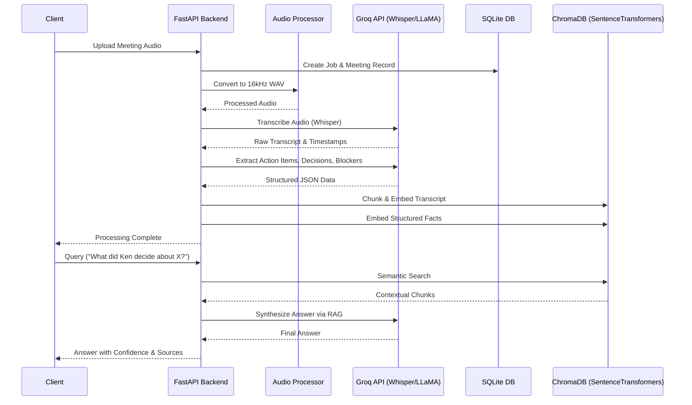

# Trace: Meeting Intelligence Platform

Trace is a full-stack platform designed to convert unstructured meeting audio into queryable organizational memory. It automatically transcribes, diarizes, and extracts structured insights (such as action items, decisions, and blockers) from uploaded meetings. These insights are indexed into a local vector database, enabling users to perform semantic search and Retrieval-Augmented Generation (RAG) across all historical meeting data.

## Architecture

The system is split into a robust FastAPI backend for heavy asynchronous data processing and a React TypeScript frontend for the user interface.

### System Workflow



## Features

- **Asynchronous Audio Pipeline**: Handles large audio files in the background without blocking the main event loop. Converts incoming files to 16kHz WAV using FFmpeg.
- **High-Speed Transcription**: Utilizes Groq's high-speed inference for Whisper to transcribe audio significantly faster than real-time.
- **Speaker Diarization**: Integrates pyannote.audio to identify and map distinct speakers to specific timestamps.
- **Structured Insight Extraction**: Transforms raw transcripts into highly structured JSON containing action items, decisions, and blockers using advanced prompt engineering.
- **Semantic Search & RAG**: Transcripts and extractions are token-chunked and embedded into ChromaDB using SentenceTransformers. Supports natural language queries to synthesize answers across multiple meetings.
- **Authentication**: JWT-based authentication to secure organizational data and ensure users only query their own meetings.

## Technologies Used

- **Backend Framework**: Python 3.11, FastAPI
- **Database**: SQLite (SQLAlchemy ORM)
- **Vector Store**: ChromaDB
- **Embeddings**: SentenceTransformers (all-MiniLM-L6-v2, running on CPU to minimize deployment footprint)
- **LLM / Transcription**: Groq API
- **Deployment**: Docker, Render

## Prerequisites

- Python 3.11+
- FFmpeg installed on the host system (required for audio preprocessing)
- A valid Groq API Key
- A valid Hugging Face Token (if diarization is enabled)

## Environment Configuration

Create a `.env` file in the `backend` directory based on the following variables:

```env
GROQ_API_KEY=your_groq_api_key
GROQ_MODEL=llama-3.3-70b-versatile
GROQ_AUDIO_MODEL=whisper-large-v3
HF_TOKEN=your_huggingface_token
SECRET_KEY=your_jwt_secret
```

## Local Development Setup

1. **Clone the repository and prepare the backend:**
   ```bash
   cd Trace/backend
   python -m venv venv
   source venv/bin/activate  # On Windows use: venv\Scripts\activate
   ```

2. **Install dependencies:**
   ```bash
   pip install --extra-index-url https://download.pytorch.org/whl/cpu -r requirements.txt
   ```
   *Note: Using the CPU index URL prevents downloading large CUDA libraries unless a GPU is explicitly targeted.*

3. **Run the backend server:**
   ```bash
   uvicorn main:app --reload
   ```
   The API will be available at `http://127.0.0.1:8000`. API documentation is automatically generated at `/docs`.

## Deployment

This repository includes a `Dockerfile` and a `render.yaml` blueprint optimized for Render deployment.

1. The Dockerfile installs system-level `ffmpeg` and pulls the CPU-only PyTorch distribution to maintain a lean image size.
2. The `render.yaml` provisions a Web Service with a Persistent Disk mounted to `/app/data` to ensure SQLite and ChromaDB persistence across deployments.

To deploy, connect this repository to a Render account and utilize the provided `render.yaml` blueprint, or select Docker as the manual runtime environment.
